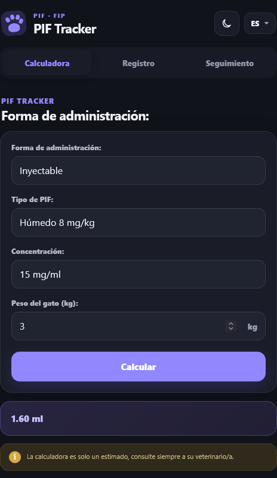
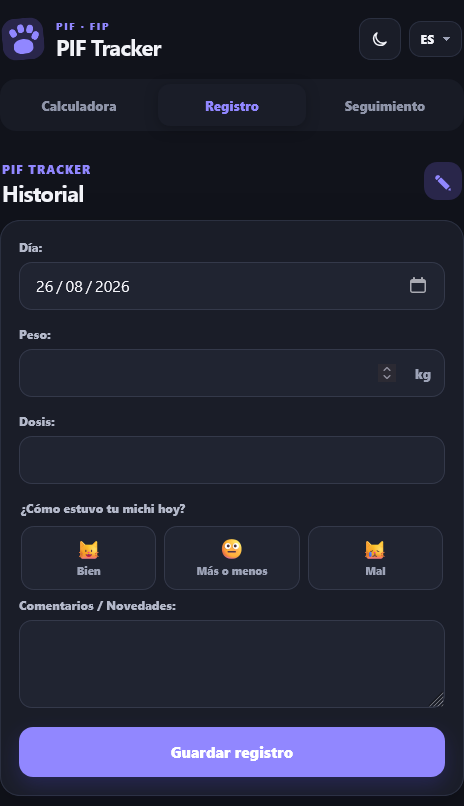
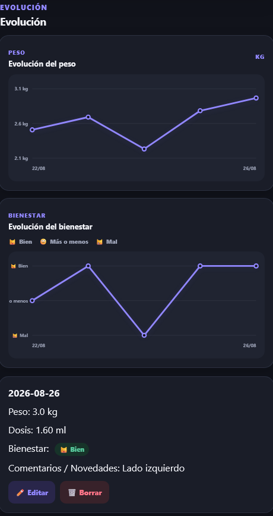
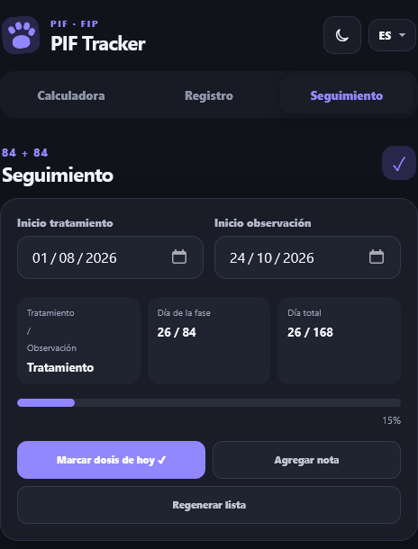
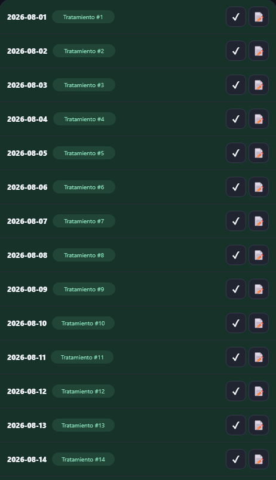

# PIF Tracker

> **ES:** Una herramienta web y Android pensada para acompañar el seguimiento diario del tratamiento contra la PIF/FIP.  
> **EN:** A web and Android companion designed to support the daily tracking of FIP treatment.

[Demo web](https://edgardovillalba.is-a.dev/pif-tracker-web/) · [Repositorio](https://github.com/Linth84/pif-tracker-web)

---

## 🇪🇸 Español

### El problema

El tratamiento contra la **PIF (Peritonitis Infecciosa Felina)** requiere constancia durante un proceso prolongado. Entre dosis, peso, observaciones diarias y el seguimiento de las etapas del tratamiento, es fácil terminar dependiendo de notas separadas, cálculos manuales o información dispersa.

**PIF Tracker nació para centralizar ese seguimiento en una sola herramienta simple y accesible.**

### La solución

PIF Tracker permite acompañar el proceso de **84 días de tratamiento + 84 días de observación**, reuniendo en una misma aplicación las tareas principales del seguimiento diario.

### Funcionalidades

- **Calculadora de dosis** según forma de administración, tipo de PIF, concentración y peso del gato.
- **Registro diario** de fecha, peso, dosis y comentarios o novedades.
- **Bienestar diario** mediante tres estados simples: 😺 Bien, 😐 Más o menos y 😿 Mal.
- **Evolución del peso** mediante un gráfico de líneas basado en los registros guardados.
- **Evolución del bienestar** mediante un gráfico de líneas basado en los estados diarios.
- **Historial editable**, permitiendo completar o corregir registros anteriores.
- **Seguimiento 84 + 84**, con fase actual, día de la fase, día total y progreso.
- **Lista diaria del tratamiento**, con posibilidad de marcar dosis y agregar notas.
- **Español e inglés**.
- **Modo claro y oscuro**.
- **Unidades adaptadas al idioma:** kg en español y lb en inglés, manteniendo internamente los datos normalizados.
- Datos persistidos localmente en el navegador para la versión web.

> **Importante:** la calculadora es una herramienta de apoyo y sus resultados son estimativos. No reemplaza la indicación ni el seguimiento de un/a veterinario/a.
>
> **Unidades e imágenes:** al utilizar la aplicación en inglés, los campos y valores de peso se muestran en **libras (lb)** en lugar de kilogramos. Las capturas incluidas a continuación son **demostrativas** y pueden mostrar la interfaz en español, valores de ejemplo o una versión visual ligeramente distinta de la aplicación actual.

### Capturas

#### Calculadora

La dosis se calcula a partir de los parámetros seleccionados y el peso ingresado.

  

#### Registro diario

Permite registrar peso, dosis, bienestar y observaciones del día.

  

#### Evolución

Los datos registrados alimentan los gráficos de evolución del peso y del bienestar.

  

#### Seguimiento 84 + 84

La aplicación muestra la fase actual y el avance dentro del tratamiento y la observación.

  

#### Control diario

Cada día del proceso puede consultarse y marcarse individualmente.

  

### Por qué construí PIF Tracker

Este proyecto no nació solamente como un ejercicio técnico. La idea fue transformar una necesidad concreta —llevar un seguimiento prolongado y ordenado— en una herramienta que reduzca cálculos manuales y concentre la información importante en un único lugar.

El foco del proyecto está en que la interfaz sea clara, rápida de consultar y cómoda tanto en móvil como en escritorio.

### Tecnologías

**Versión web**

- HTML5
- CSS3
- JavaScript
- Local Storage
- Responsive Design
- GitHub Pages

**Versión Android**

PIF Tracker también cuenta con una versión para Android, manteniendo el mismo objetivo de acompañar el seguimiento del tratamiento desde el teléfono.

---

## 🇬🇧 English

### The problem

**FIP (Feline Infectious Peritonitis)** treatment requires consistency throughout a long process. Between doses, weight, daily observations, and treatment-stage tracking, caregivers can easily end up relying on separate notes, manual calculations, and scattered information.

**PIF Tracker was created to bring that daily tracking together in one simple and accessible tool.**

### The solution

PIF Tracker supports the **84 days of treatment + 84 days of observation** journey by bringing the main day-to-day tracking tasks into a single application.

### Features

- **Dose calculator** based on administration method, FIP type, concentration, and cat weight.
- **Daily records** for date, weight, dose, comments, and updates.
- **Daily wellness tracking** with three simple states: 😺 Good, 😐 So-so, and 😿 Bad.
- **Weight evolution** displayed as a line chart based on saved records.
- **Wellness evolution** displayed as a line chart based on daily wellness entries.
- **Editable history**, allowing older entries to be completed or corrected.
- **84 + 84 tracking**, including current phase, phase day, total day, and progress.
- **Daily treatment list**, with dose completion and note tracking.
- **Spanish and English** support.
- **Light and dark modes**.
- **Language-aware weight units:** kg in Spanish and lb in English, while keeping stored data normalized internally.
- Local browser persistence for the web version.

> **Important:** the calculator is a support tool and its results are estimates. It does not replace veterinary advice or professional follow-up.
>
> **Units and screenshots:** when the application is used in English, weight fields and values are displayed in **pounds (lb)** instead of kilograms. The screenshots below are provided **for demonstration purposes only** and may show the Spanish interface, example values, or a slightly different visual version of the current application.

### Screenshots

#### Dose calculator

  

#### Daily log

  

#### Evolution

Saved entries feed the weight and wellness evolution charts.

  

#### 84 + 84 tracking

  

#### Daily treatment control

  

### Why I built PIF Tracker

This project was not created only as a technical exercise. The goal was to turn a concrete need —keeping a long treatment process organized— into a tool that reduces manual calculations and keeps important information in one place.

The interface is designed to remain clear, quick to check, and comfortable on both mobile and desktop.

### Technologies

**Web version**

- HTML5
- CSS3
- JavaScript
- Local Storage
- Responsive Design
- GitHub Pages

**Android version**

PIF Tracker also has an Android version built around the same goal: making treatment tracking readily available from a phone.

---

## Estado del proyecto / Project status

PIF Tracker continúa evolucionando con mejoras de interfaz y nuevas herramientas de seguimiento.  
PIF Tracker continues to evolve with interface improvements and additional tracking tools.

---

## Autor / Author

**Edgardo Villalba**  
https://edgardovillalba.is-a.dev/
